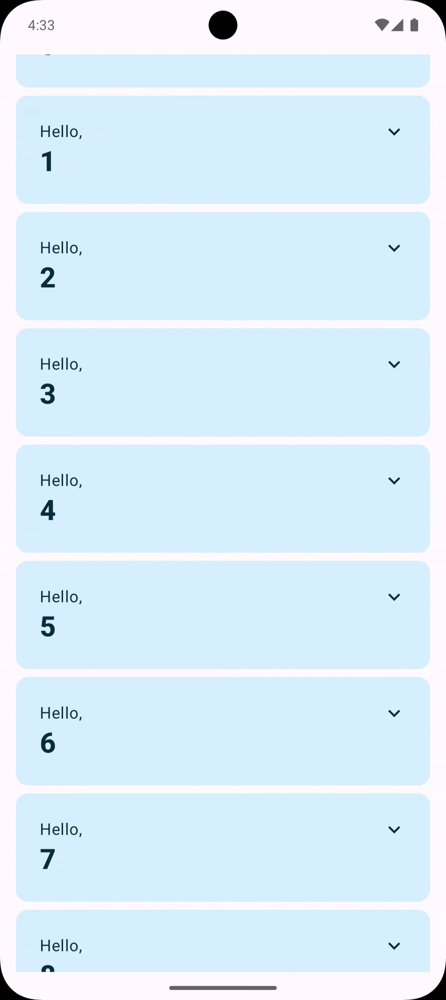
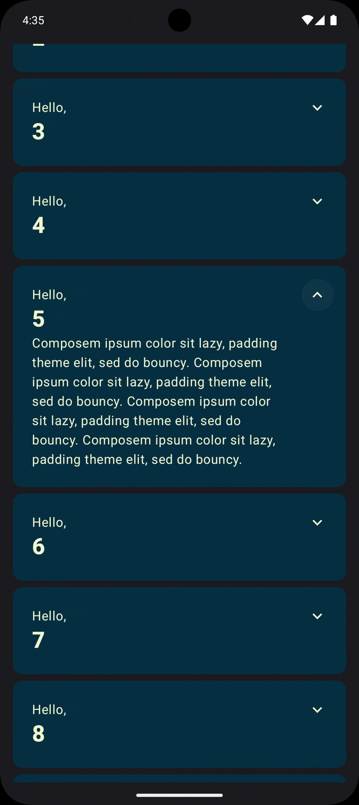

# 📱 Codelab 01 – Jetpack Compose Basics

## Simple Greeting Cards Application

This project is based on the official [Jetpack Compose Basics Codelab](https://developer.android.com/codelabs/jetpack-compose-basics).

## 📚 I Practiced

- Basics of Jetpack Compose
- Building UI using composable function
- Manage UI State using MutableState and Remember/RememberSaveable
- Simple Animations
- Styling and theming with Material 3

## 🎥 Gifs

